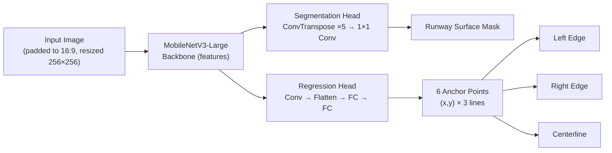
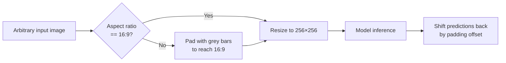

# RWY.Vision

### Runway Edge & Centerline Detection from a Single Image


A dual-head convolutional network that locates a runway's **left edge**, **right edge**, and **centerline** from a single RGB frame — trained on an 11GB dataset, served through a FastAPI backend, with a live browser demo.

---

## Demo

<!-- Add a screenshot or GIF of the frontend here -->
<!--  -->

## Results

Evaluated on a held-out validation set of **733 images**, unseen during training.

| Metric | Value |
|---|---|
| **Mean IoU** | `0.702` |
| **Mean Line Error** | `11.73 px` |
| **Epochs** | `100` |
| **LR schedule** | Cosine decay |
| **Backbone** | MobileNetV3-Large |

## Architecture

A shared **MobileNetV3-Large** backbone feeds two task-specific heads — one dense, one sparse — trained jointly.



<details>
<summary><b>Segmentation head detail</b></summary>

```
ConvTranspose2d(960 → 256) → BatchNorm → ReLU
ConvTranspose2d(256 → 128) → BatchNorm → ReLU
ConvTranspose2d(128 →  64) → BatchNorm → ReLU
ConvTranspose2d( 64 →  32) → BatchNorm → ReLU
ConvTranspose2d( 32 →  16) → BatchNorm → ReLU
Conv2d(16 → 1, kernel=1)                          # runway mask
```
</details>

<details>
<summary><b>Regression head detail</b></summary>

```
Conv2d(960 → 128, kernel=1) → BatchNorm → ReLU
Flatten
Linear(128×8×8 → 256) → ReLU → Dropout(0.3)
Linear(256 → 12) → Sigmoid                        # 6 (x,y) anchor points, normalized
```
</details>

## Preprocessing: aspect-ratio-safe inference

Training images are all 640×360 (16:9). Feeding the model an image with a *different* aspect ratio and naively squishing it to 256×256 distorts geometry the model never learned. Inference pads any input to 16:9 with neutral bars **before** the resize, so every image is stretched the same way the model was trained on — then predictions are shifted back into the original image's coordinate frame.



## Project structure

```
.
├── inference.py          # Standalone inference: load checkpoint, predict on one image
├── app.py                 # FastAPI backend exposing POST /predict
├── runway_frontend.html   # Browser demo — upload an image, see predicted lines
├── runway_model_best.pth  # Trained weights (hosted separately — see below)
└── README.md
```

## Setup & running locally

```bash
pip install torch torchvision opencv-python matplotlib fastapi uvicorn python-multipart
```

**CLI inference:**
```bash
python inference.py path/to/image.jpg
```

**Web demo:**
```bash
# Terminal 1
python app.py

# Terminal 2
python -m http.server 8080
```
Open `http://localhost:8080/runway_frontend.html`.

> **Checkpoint:** `runway_model_best.pth` isn't committed (see `.gitignore` — GitHub isn't built for large binaries). Download it here: **[Add your Release/Drive link]**

## Training

- **Dataset:** ~11GB of runway imagery, 640×360, flight-simulator sourced
- **Loss:** Combined segmentation loss (mask) + anchor point regression loss (coordinates)
- **Optimizer:** Cosine LR decay, 100 epochs
- **Environment:** Google Colab (GPU)

## Known limitations

- **Domain gap:** trained on simulator-sourced imagery. Performs strongly on in-distribution validation data (`0.702 IoU`), but accuracy drops on real-world aerial/ground photographs — particularly asymmetric edge tracking (one edge detected more precisely than the other) under unfamiliar camera geometry. Closing this gap via real-photo fine-tuning or heavier augmentation is the main direction for future work.
- Not extensively validated on unusual angles, low-altitude shots, or adverse weather.

## Tech stack

`PyTorch` · `torchvision (MobileNetV3)` · `OpenCV` · `FastAPI` · `vanilla JS/HTML/CSS`
